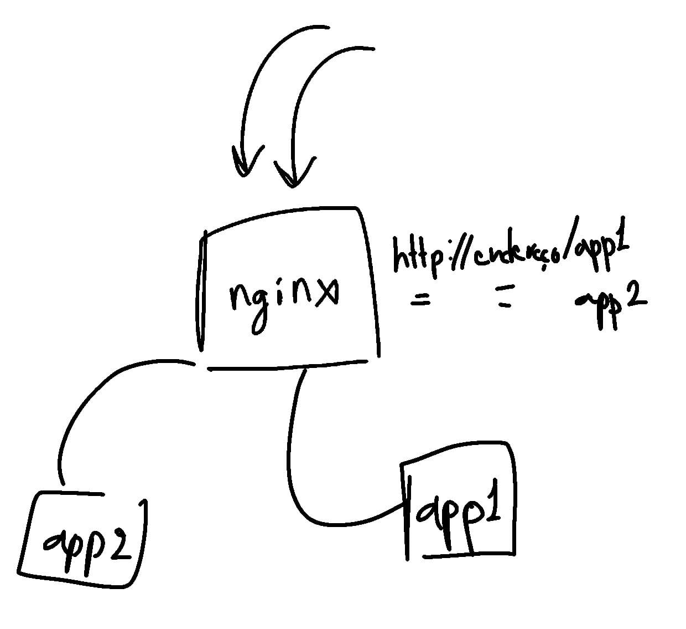

# Aula - 09/09/2025

Conteúdos ministrados: Aula 00 - Apresentação da disciplina; - Aula 01 -
Histórico e Contextualização dos sistemas de computação em Nuvem.

## Ementa da Disciplina

**Curso:** Curso Superior de Tecnologia em Sistemas para Internet
**Disciplina:** Desenvolvimento Web para a Nuvem **Carga-Horária:** 60h
(80h/a) **Pré-Requisito(s):** Desenvolvimento Web Back-end **Número de
créditos:** 4

<div class="center">

EMENTA

</div>

Conhecer o estado da arte sobre desenvolvimento web para a nuvem.

<div class="center">

PROGRAMA

</div>

<div class="center">

Objetivos

</div>

- Aprender sobre os modelos de computação em nuvem;

- Conhecer os desafios do ambiente em nuvem;

- Conhecer cenários de utilização em ambientes em nuvem;

- Conhecer e desenvolver softwares como serviço.

<div class="center">

Bases Científico-Tecnológicas (Conteúdos)

</div>

- 1\. Princípios

  - 1.1. Histórico e Contextualização dos sistemas de computação em
    Nuvem;

  - 1.2. Introdução aos tipos de nuvens;

  - 1.3. Benefícios, desafios e riscos das plataformas de serviços;

  - 1.4. Cenários de Utilização;

  - 1.5. Modelos de negócios aplicáveis às nuvens.

- 2\. Modelos de Computação em Nuvem

  - 2.1. Software como serviço (SaaS);

  - 2.2. Infraestrutura como serviço (Iaas);

  - 2.3. Plataforma como serviço (PaaS);

  - 2.4. Middlewares para computação em nuvem.

- 3\. Configuração

  - 3.1. Administração e Regras;

  - 3.2. Escalonamento;

  - 3.3. Balanceamento de recursos em computação nas nuvens.

- 4\. Desafios de Programação para Computação em Nuvem

  - 4.1. Segurança;

  - 4.2. Privacidade;

  - 4.3. Legado

    - 4.3.1. Migração de sistemas para nuvem.

- 5\. Gerenciamento de Dados e Otimização

  - 5.1. Gerenciamento de dados e desafios de manutenção nos sistemas de
    computação nas nuvens;

  - 5.2. Visão geral de técnicas de otimização incluindo o gerenciamento
    de consumo de energia elétrica.

- 6\. Migração e Transformação de Servidores

  - 6.1. Migração e transformação de servidores para provedores de
    nuvem;

  - 6.2. Desafios na área de descoberta do ambiente fonte;

  - 6.3. Definição de ambiente destino;

  - 6.4. Decisões de estratégias de migração e transformação.

<div class="center">

Procedimentos Metodológicos

</div>

Aulas expositivas; estudos dirigidos; seminários; vídeos; dinâmicas de
grupo; visitas técnicas; palestras.

<div class="center">

Recursos Didáticos

</div>

Quadro branco e pincel; computador; internet; projetor de multimídia.

<div class="center">

Avaliação

</div>

Trabalho escrito; apresentação de seminários; relatórios; avaliação
escrita.

<div class="center">

Bibliografia Básica

</div>

- 1\. ERL, Thomas. Cloud Computing: Concepts, Technology & Architecture.
  Editora Prentice Hall. 2013.

- 2\. VELTE, Anthony T. Cloud Computing. Computação Em Nuvem: Uma
  Abordagem Prática. Alta Books. 2012.

- 3\. FOX, Armando; PATTERSON, David. Construindo Software como Servico
  (SaaS): Uma Abordagem Agil Usando Computacao em Nuvem (Portuguese
  Edition). Editora Strawberry Canyon LLC. 2015.

<div class="center">

Bibliografia Complementar

</div>

- 1\. BRIAN, J.S. Chee; FRANKLIN, Jr., Curtis. Computação em Nuvem:
  Cloud Computing - Tecnologias e Estratégias. 1. ed. M.Books. 2013.

- 2\. Above the Clouds: A Berkeley View of Cloud Computing. Relatório
  Técnico. 2009.

- 3\. BIRMAN, Kenneth. Guide to Reliable Distributed Systems: Building
  High-Assurance Applications and Cloud-Hosted Services. Springer. 2012.

- 4\. VERAS, Manoel. Computação em Nuvem: Nova Arquitetura de TI. 1. ed.
  2015.

- 5\. KAVIS, Michael J. Architecting the Cloud: Design Decisions for
  Cloud Computing Service Models (SaaS, PaaS, and IaaS). Editora Wiley.
  2014.

<div class="center">

Software(s) de Apoio:

</div>

- IDEs.

## Histórico e Contextualização dos sistemas de computação em Nuvem.

...

# Aula - 10/09/2025

Conteúdos ministrados: Aula 02: - Surgimento dos Containers
-Orquestração de Containers -Kubernetes

## Aula 02: - Surgimento dos Containers -Orquestração de Containers -Kubernetes

...

# Aula - 16/09/2025

Conteúdos ministrados: Introdução aos tipos de nuvens e Benefícios,
desafios e riscos das plataformas de serviços.

## Introdução aos tipos de nuvens e Benefícios, desafios e riscos das plataformas de serviços.

...

# Aula - 17/09/2025

Conteúdos ministrados: SAAS, IAAS e PAAS - Introdução a Containers

## SAAS, IAAS e PAAS - Introdução a Containers

...

# Aula - 23/09/2025

Conteúdos ministrados: Operações com container;

## Operações com container;

...

# Aula - 24/09/2025

Conteúdos ministrados: Operações com container.

## Operações com container.

...

# Aula - 30/09/2025

Conteúdos ministrados: Configurações de limites no container docker.

## Configurações de limites no container docker.

...

# Aula - 07/10/2025

Conteúdos ministrados: Configuração de recursos de hardware para
conteineres.

## Configuração de recursos de hardware para conteineres.

...

# Aula - 08/10/2025

Conteúdos ministrados: Volumes em docker

## Volumes em docker

...

# Aula - 14/10/2025

Conteúdos ministrados: Configuração de volume reutilizável com read-only
em docker.

## Configuração de volume reutilizável com read-only em docker.

...

# Exam - 21/10/2025

Content of the exam: docker concepts and fundamentals.

## Question 6

We were presented a broken dockerfile. To create the fixed one, the
following command was used:

``` bash
      touch Dockerfile && echo "FROM nginx:latest
      COPY ./sites /usr/share/nginx/html
      EXPOSE 80" >> Dockerfile
```

Before building the image and running the container, we need to create
the folder "sites" and a file to change the **nginx** default
**index.html**. This was done:

``` bash
      mkdir sites
      touch sites/index.html
      echo "testando" >> sites/index.html
```

To build the image:

``` bash
      docker build -t exam:latest .
```

To run a container:

``` bash
      # You can also assign a name to it using --name
      docker run -ti -d -p 8080:80 exam:latest
```

To get the default page and check it’s contents:

``` bash
      wget localhost:8080
      cat index.html 
```

# Lecture - 22/10/2025

Content taught: correction of the exam, creating and managing images.

## Question 6

The wrong Dockerfile was:

``` bash
      # Broken Dockerfile
      FROM nginx:latest

      # Copying HTML files to a folder
      COPY ./site /usr/share/nginx/html_site

      # Default port to Nginx
      EXPOSE 80
```

To run the code wehad to change some things. The first thing to change
about the dockerfile was the source directory **site** that did not
exist from the first place. Then we had to change the target folder. The
default nginx folder was **/usr/share/nginx/html**. So the correct
dockerfile would be something like this:

``` bash
      # Fixed Dockerfile
      FROM nginx:latest

      # Copying HTML files to the correct folder
      COPY ./site /usr/share/nginx/html

      # Default port to Nginx
      EXPOSE 80
```

## How to create a new Docker environment

The first step to create a environment inside a docker container, is to
create a Dockerfile.  
We can then build the Dockerfile to create an image.  
After the image is built, we can run a new container using our newly
made image.

Example dockerfile:

``` bash
      FROM debian

      RUN echo "hello, world"
```

To build it, just run:

``` bash
      # Inside the folder where the Dockerfile is
      docker build -t <image-name>:<version-name> .
```

## FROM command

Using the [FROM
command](https://docs.docker.com/reference/dockerfile/#from) you can
select which image you can base your Dockerfile upon.

## RUN command

The [RUN command](https://docs.docker.com/reference/dockerfile/#run)
lets you execute bash commands when creating the image while reading the
Dockerfile.

## ENTRYPOINT command

The [ENTRYPOINT
command](https://docs.docker.com/reference/dockerfile/#entrypoint) let
we use an executable when initializing the image.

## CMD command

We can use [CMD
command](https://docs.docker.com/reference/dockerfile/#cmd) to when
passing parameters to the ENTRYPOINT command.

## Multi-stage builds

[Multi-stage
builds](https://docs.docker.com/build/building/multi-stage/)...

## Docker container commit

[Docker container
commits](https://docs.docker.com/reference/cli/docker/container/commit/)
seem to me like version control for docker containers, meaning that you
can change the image and have a version controller that remembers the
last version.

## Best practices

1\. Minimal base images  
2. Minimal layers  
3. Cleaning after the packages installations  
4. Non-root app running

## Images management commands

docker image ls  
docker image rm  
docker prune  
docker tag

## Network management

Container’s network management.

<figure id="fig:nginx reverse proxy">

<figcaption><span id="fig:nginx reverse proxy"
label="fig:nginx reverse proxy"></span>Draft of the use of nginx as a
reverse proxy.</figcaption>
</figure>

# Lecture - 29/10/2025

Content taught: Docker Compose

# Assignment - 05/11/2025

Assignment description: Resolver o problema relacionado ao docker
compose, há um arquivo em anexo e este está com problema de sintaxe, ao
executar e tentar acessar a aplicação no navegador é apresentado a
seguinte mensagem "Error establishing a database connection". Dessa
forma, este pequeno desafio está na verificação e conserto do arquivo
docker-compose.yml para tornar o wordpress funcional.

# LaTeX

I shall take notes with LaTeXand then convert them to Markdown. To
convert it into my README.md, I’ll just use the following:

``` bash
pandoc main.tex -o README.md --from=latex --to=gfm
```
